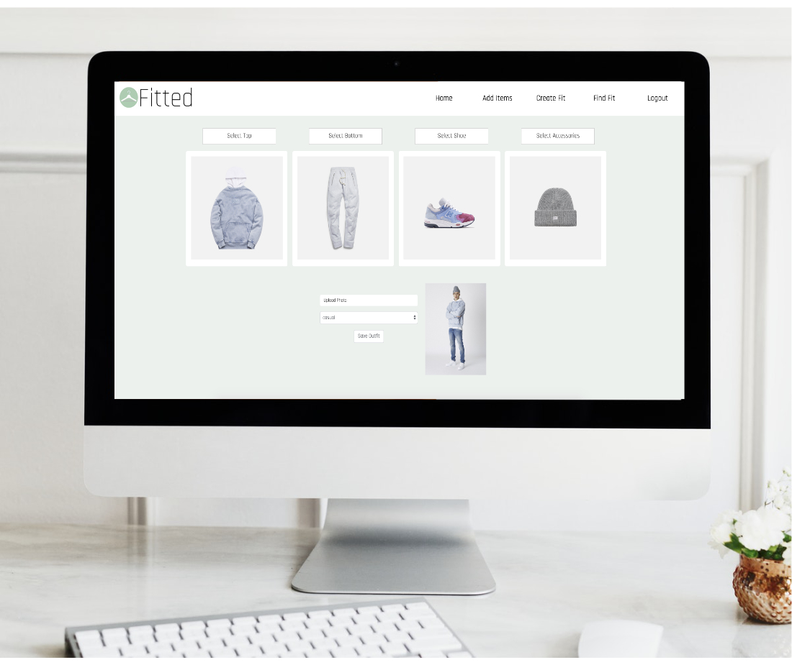

## Fitted

Fitted is a full CRUD react app that allows users to catalog clothing items and build outfits. Fitted was created to relieve the stress and time of trying to look your best every morning.




## Problem

Have you ever woken up late, been in a rush in the morning and just don't know what to wear? Fitted is here to help with that.
With the ability to add clothing, create outfits and filter by style or select a specific item to find outfits with fitted wants to make your morning routine less stressful. Whether you're a fashion expert needing to organize, or a user just wanting to have simple reminders of what pieces go together, Fitted wants to help solve your morning scramble to look your best.

## Installation

```bash
npm i --save react-router-dom
npm instal moment --save


npm start from the root directory to run application
```

## Database Sample

```JSON
{
  "users": [],
  "clothing": [],
  "clothingTypes": [
    {
      "id": 1,
      "type": "top"
    },
    {
      "id": 2,
      "type": "bottom"
    },
    {
      "id": 3,
      "type": "shoe"
    },
    {
      "id": 4,
      "type": "accessory"
    }
  ],
  "outfits": [],
  "clothingOutfits": [],
  "styles": [
    {
      "id": 1,
      "styleType": "casual"
    },
    {
      "id": 2,
      "styleType": "work"
    },
    {
      "id": 3,
      "styleType": "dress"
    }
  ],
  "dateWorn": []
}
```
